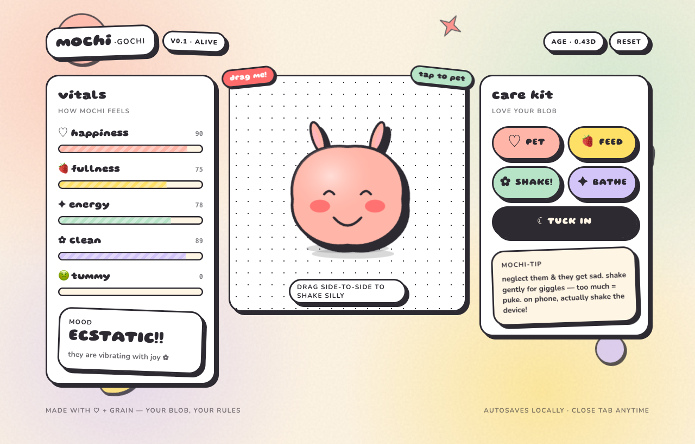

# mochi-gochi

A cute virtual pet you can pet, feed, shake, and accidentally explode. Built with Next.js 14, React, TypeScript, and Tailwind.



## About

This project was built as part of [Nick Chapsas](https://nickchapsas.com/)' [**Vibe Coding for Production**](https://dometrain.com/workshop/vibe-coding-for-production/) workshop on Dometrain.

The workshop reframes AI-assisted development as disciplined engineering rather than reckless automation — teaching how to practice *agentic coding* safely while keeping architectural control. Topics include Claude Code and Codex, setting boundaries for AI agents, converting vague requirements into testable specs, building extended multi-hour generation/testing plans, security and stability verification, custom skills, and Model Context Protocol (MCP) integration. The goal: collaborate with AI as a "senior engineer" partner and ship production code that's still maintainable and reviewable.

This repo is one such exercise — a small, playful product taken end-to-end with an AI coding assistant.

## Features

- **Egg phase**: every new pet starts as an egg. Shake (device or drag) to hatch.
- **Random mochi**: each hatch generates a random body shape, color, and ear style (450 combinations).
- **Care loop**: pet, feed, bathe, sleep. Stats decay over time and persist via `localStorage`.
- **Device motion**: physical phone shaking moves the mochi proportionally to the gyro/accelerometer.
- **Consequences**: shake too much → motion sickness → puke → sick. Shake a sick mochi → 💥 BOOM.
- **iOS support**: prompts for `DeviceMotionEvent` permission on first interaction.

## Run locally

```bash
npm install
npm run dev
```

Open http://localhost:3000.

## Mobile testing

Device motion needs HTTPS. Quickest tunnel:

```bash
brew install --cask devtunnel
devtunnel user login
devtunnel host -p 3000 --allow-anonymous
```

Open the printed `*.devtunnels.ms` URL on your phone.

## Stack

- Next.js 14 (App Router)
- React 18
- TypeScript
- Tailwind CSS
- SVG for all pet rendering
